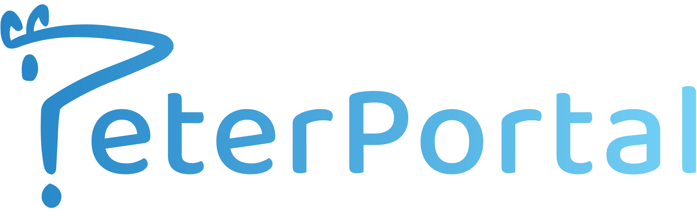

<h1>
  
</h1>

The One-Stop-Shop for course discovery at UC Irvine.

## Overview
---

### PeterPortal is a web application aimed to aid UCI students with course discovery. We consolidate public data available on multiple UCI sources on the application to improve the user experience when planning their course schedule.

## Features
---
- Filtered catalogue/professor search
- Visual dependency/prerequisite tree
- Visual grade distribution history
- Visual schedule of classes
- Professors rating/review

## Development
---
<h3>
  <span>
  This project is built with
    
    
    
  </span>
</h3>

After cloning the project repo, run `npm install` on the PeterPortal directory to install all required NodeJS dependencies for both the React client and Express server of the application.

__To start the development server for the React client__, run `npm run start-server-dev` in the terminal from the PeterPortal directory. The React development server will run and listen for changes on `localhost:3000`.

__To start the development server for the Express API and server__, install [Nodemon](https://nodemon.io/) and then run `npm run start-server-dev` in the terminal from the PeterPortal directory. The Express server will run and listen for changes on `localhost:5000`.

>__Note:__ PeterPortal API is set to run on the subdomain of the server (api.peter-portal.com). Therefore, in order to develop and test the API routes locally, you must configure your machine's `hosts` file to include 
>```
>127.0.0.1   peter-portal.dev
>127.0.0.1   api.peter-portal.dev
>```
>You may now make requests to the API local endpoint @ `api.peter-portal.dev:5000`

